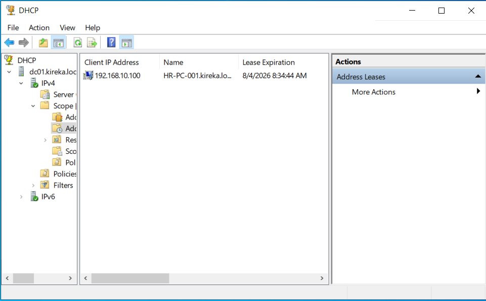
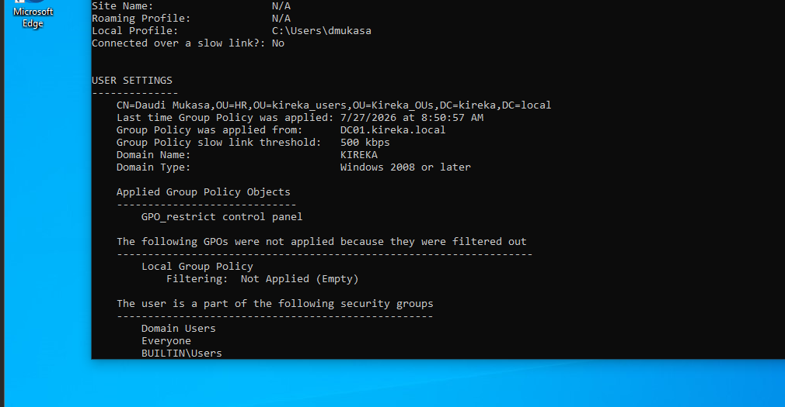

# Active Directory Home Lab

## Project Overview

This lab simulates a realistic enterprise network infrastructure built in **VMware Workstation Pro**. The goal of this project is to demonstrate deploying, configuring, and managing Active Directory Domain Services (AD DS), DNS, DHCP, and Group Policy Objects (GPOs).

---

## Network & Architecture Diagram

```
                       [ Internet ]
                            |
                     [ NAT Router ]
                            |
     +----------------------+----------------------+
     |                                             |
[ DC01 - Windows Server 2022 ]           [ CLIENT01 - Windows 10 ]
- IP: 192.168.10.10                      - IP: 192.168.10.100
- Domain: KIREKA.LOCAL                     - Joined to KIREKA.LOCAL
- Roles: AD DS, DNS, DHCP
```

---

## Tools & Technologies

- **Hypervisor:** VMware Workstation Pro
- **Server OS:** Windows Server 2022
- **Client OS:** Windows 10 Enterprise
- **Services:** AD DS, DNS, DHCP, Group Policy, PowerShell

---

## Key Configurations & Features Implemented

### 1. Active Directory & Organizational Units (OUs)

- Created a tiered OU structure following administrative best practices (`KIREKA.LOCAL/kireka_Users`, `kireka_computers`, `kireka_groups`, `kireka_admins`).
- Populated users and security groups using PowerShell automation.

### 2. Group Policy Objects (GPOs)

- **Password Policy:** Enforced minimum length (12 characters), complexity, and lockout after 5 failed attempts.
- **Security & Hardening:** Disabled Control Panel access for standard users and mapped network drives based on group membership.

### 3. Network Services

- Configured DHCP Scope (`192.168.10.100` - `192.168.10.200`) with custom DNS options pointing to the Domain Controller.
- DNS forward lookup zones configured for internal host resolution.

---

## Visual Illustrations

### Active Directory Users & Computers



### Group Policy Enforcement (`gpresult /r`)



---

## PowerShell Automation

Automated bulk user creation using the script located in `scripts/create-bulk-users.ps1`.

---

## Key Learnings & Troubleshooting

- **Issue:** Client machine couldn't locate the domain during domain join.
- **Root Cause:** DNS adapter on the client was pointed to the default home gateway instead of the DC's static IP.
- **Fix:** Manually updated DNS settings in the virtual adapter and flushed local DNS cache.
