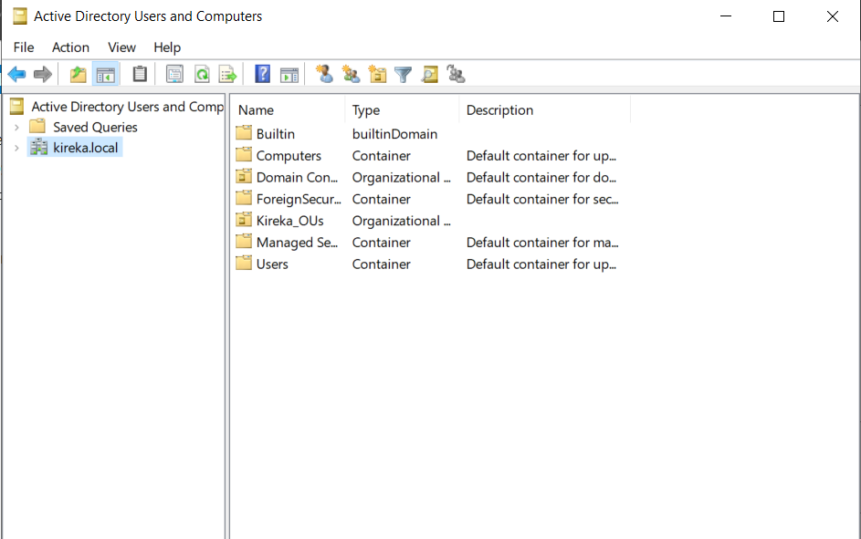
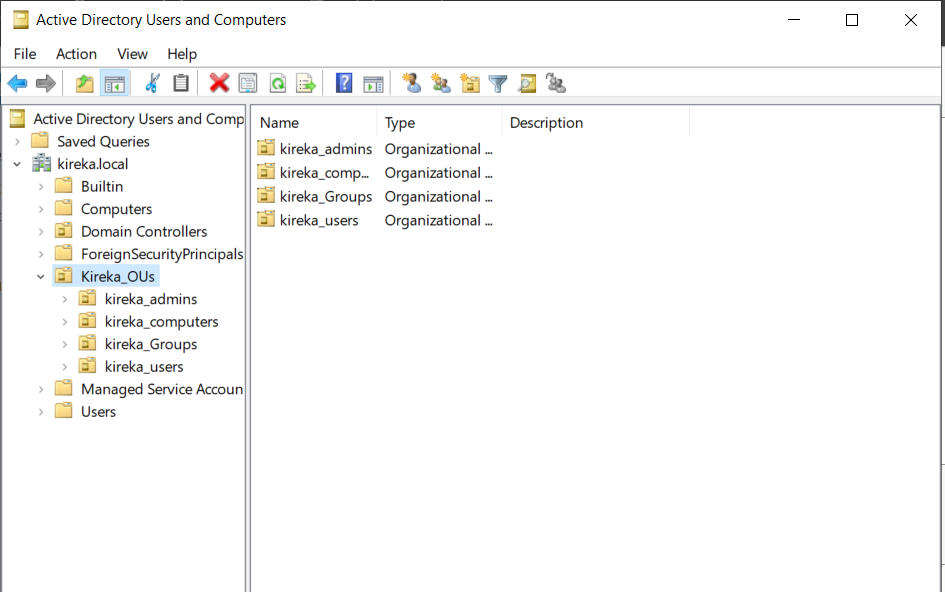

# Enterprise Active Directory Infrastructure Lab

## Overview

This project demonstrates the deployment and administration of a Windows Server Active Directory environment designed to simulate a small enterprise network. The lab was built in **VMware Workstation Pro** and includes a fully functional Active Directory Domain Services (AD DS) infrastructure supporting centralized authentication, DNS, DHCP, Group Policy management, and domain-joined Windows clients.

The objective was to gain hands-on experience with Windows Server administration by implementing core identity and network services commonly managed by Systems Administrators in enterprise environments.

---

## Business Objectives

- Deploy an enterprise Active Directory Domain.
- Centralize authentication and user management.
- Configure automated IP address allocation using DHCP.
- Implement DNS for Active Directory name resolution.
- Apply security and administrative policies using Group Policy.
- Join multiple Windows client computers to the domain.
- Automate administrative tasks with PowerShell.

---

# Infrastructure Overview

| Component         | Configuration                                                           |
| ----------------- | ----------------------------------------------------------------------- |
| Hypervisor        | VMware Workstation Pro                                                  |
| Server OS         | Windows Server 2022                                                     |
| Client OS         | Windows 10 Enterprise                                                   |
| Domain            | KIREKA.LOCAL                                                            |
| Domain Controller | DC01                                                                    |
| Client Computers  | 5 Domain-Joined Windows 10 PCs                                          |
| Services          | AD DS, DNS, DHCP, Group Policy                                          |
| Administration    | Active Directory Users & Computers, Group Policy Management, PowerShell |

---

# Network Architecture

```text
                               Internet
                                   │
                             VMware NAT Network
                                   │
             ┌─────────────────────┴─────────────────────┐
             │                                           │
     DC01 (Windows Server 2022)                 Windows 10 Clients
       192.168.10.10                             CLIENT01
                                                  CLIENT02
Roles:                                            CLIENT03
• Active Directory                                CLIENT04
• DNS                                             CLIENT05
• DHCP
• Group Policy
```

---

# Skills Demonstrated

- Windows Server Administration
- Active Directory Domain Services (AD DS)
- Domain Administration
- User & Computer Management
- Organizational Unit (OU) Design
- Security Group Administration
- DNS Administration
- DHCP Administration
- Group Policy Management
- PowerShell Automation
- Windows Client Administration
- Identity & Access Management
- Enterprise Network Administration
- Troubleshooting & Root Cause Analysis

---

# Active Directory Design

Designed an Organizational Unit (OU) structure that separates administrative objects according to enterprise best practices.

```
KIREKA.LOCAL

│

├── Users

├── Computers

├── Security Groups

├── Administrators

└── Service Accounts
```

This structure simplifies administration, delegation, and Group Policy application.

---

# User & Group Administration

Configured centralized identity management by creating:

- User Accounts
- Security Groups
- Administrative Accounts
- Computer Objects

Bulk user provisioning was automated using PowerShell scripts to simulate onboarding in an enterprise environment.

---

# Domain-Joined Client Computers

Successfully joined five Windows 10 Enterprise client machines to the Active Directory domain.

| Computer | Status        |
| -------- | ------------- |
| CLIENT01 | Domain Joined |
| CLIENT02 | Domain Joined |
| CLIENT03 | Domain Joined |
| CLIENT04 | Domain Joined |
| CLIENT05 | Domain Joined |

Each workstation receives authentication, Group Policies, and DNS configuration directly from the Domain Controller.

---

# DNS Configuration

Configured Active Directory-integrated DNS to provide reliable internal name resolution.

Implemented:

- Forward Lookup Zone
- Automatic Host Record Registration
- Domain Name Resolution
- Client DNS Configuration

Correct DNS configuration ensured successful domain authentication and service discovery.

---

# DHCP Configuration

Configured DHCP to automate IP address assignment across the domain.

### Scope Configuration

| Setting         | Value                           |
| --------------- | ------------------------------- |
| Network         | 192.168.10.0/24                 |
| Scope Range     | 192.168.10.100 – 192.168.10.200 |
| Default Gateway | 192.168.10.1                    |
| DNS Server      | 192.168.10.10                   |
| Domain          | KIREKA.LOCAL                    |

Clients automatically receive:

- IP Address
- Default Gateway
- DNS Server
- Domain Name

---

# Group Policy Implementation

Implemented multiple Group Policy Objects (GPOs) to enforce centralized security and administrative controls.

### Password Policy

- Minimum Length: 12 Characters
- Password Complexity Enabled
- Maximum Password Age Configured
- Account Lockout Threshold: 5 Failed Attempts

---

### Desktop Restrictions

Configured policies to improve workstation security, including:

- Disabled Control Panel access
- Restricted unauthorized system configuration changes

---

### Drive Mapping

Configured automatic network drive mapping based on user group membership.

---

# PowerShell Automation

Automated administrative tasks using PowerShell, including:

- Bulk User Creation
- Organizational Unit Population
- Security Group Assignment

Example:

```powershell
New-ADUser
Add-ADGroupMember
New-ADOrganizationalUnit
```

Automation significantly reduces repetitive administrative tasks and improves deployment consistency.

---

# Security Best Practices

Applied enterprise administration principles throughout the deployment.

Implemented:

- Static IP configuration for Domain Controller
- Principle of Least Privilege
- Password Complexity Policies
- Account Lockout Policies
- Organizational Unit Separation
- Security Group-Based Administration

---

# Troubleshooting & Problem Solving

## Domain Join Failure

### Issue

Client computers were unable to locate the Active Directory domain during the join process.

### Root Cause

The client machines were configured to use the home router as their DNS server instead of the Domain Controller.

### Resolution

- Updated DNS settings to point to the Domain Controller.
- Flushed cached DNS records.
- Verified domain resolution using:

```powershell
ipconfig /flushdns
nslookup kireka.local
```

Successfully joined all five client computers to the domain.

---

# Project Screenshots

## Active Directory Users and Computers



---

## Organizational Units



---

## DHCP Leases


---

## Group Policy Results


---

## Domain-Joined Client


---

# What This Project Demonstrates

This project demonstrates practical Windows Server administration skills expected of an **IT Support Engineer**, **Systems Administrator**, or **Infrastructure Support Engineer**, including:

- Active Directory deployment and administration
- Identity and access management
- Windows Server infrastructure management
- DNS and DHCP administration
- Group Policy design and implementation
- Enterprise workstation management
- PowerShell automation
- Troubleshooting Active Directory and networking issues
- Enterprise documentation using GitHub

---

# Key Takeaways

Through this project, I gained hands-on experience deploying and administering a Windows Active Directory environment that mirrors the core services used in enterprise networks. The implementation strengthened my understanding of centralized identity management, Windows Server administration, Group Policy, DNS, DHCP, client management, PowerShell automation, and infrastructure troubleshooting—skills directly applicable to IT Support, Systems Administration, and Infrastructure Engineering roles.
